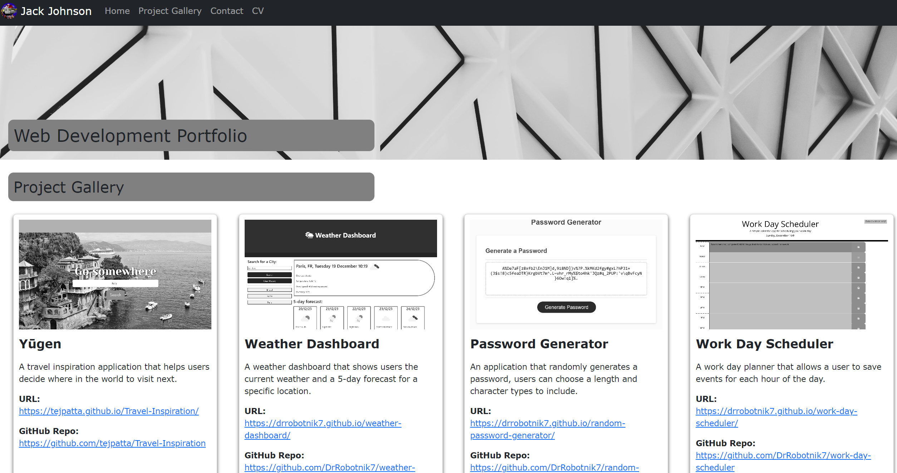

# Jack Johnson's Web Development Portfolio

## Description

A portfolio built using React that showcases my web development skills and projects. This is a single page application that utilises React Router to dynamically render content instead of redirecting to a new URL and loading the entire page. This makes the website much faster to navigate.

## Table of Contents

- [Installation](#installation)
- [Usage](#usage)
- [Credits](#credits)
- [License](#license)

## Installation

URL: https://drrobotnik7.github.io/web-development-portfolio/

- Simply click on the URL to be navigated to the web page in your browser

## Usage

- The home page contains an About me section and my Skills.
- Use the navigation bar links to view my Project Gallery and Contact details page.
- In the project gallery click on the project card image or the URL to be navigated to the application.
- In the contact page there is a form you can submit to send me a direct message.

## Credits

I would like to acknowledge my peers in Sibert-pod-11. We're all on the same learning journey and have helped each other massively during the front-end web development skills boot camp.

I might need to acknowledge myself, as I used code from prior portfolio projects.

I used React Bootstrap components found on this website: https://react-bootstrap.netlify.app

Finally I used https://getform.io/ to generate my form endpoint so I can store and view messages submitted by users on my Contact page.

## License

No license chosen